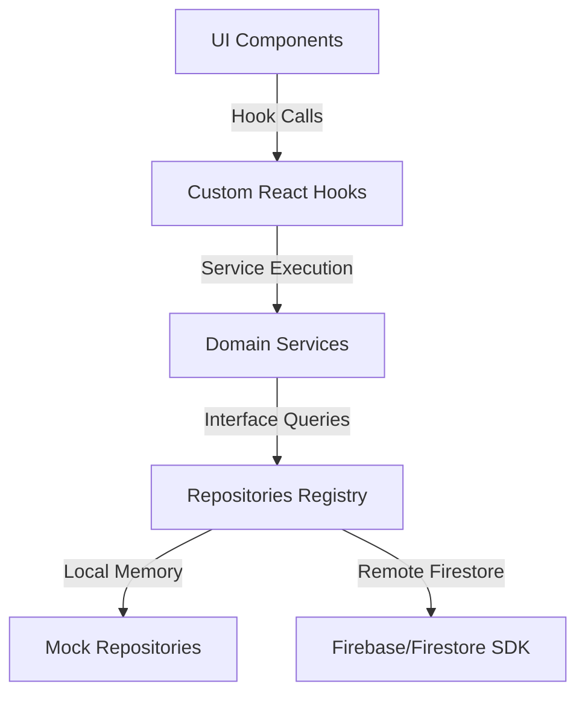

# MedBids Architecture Documentation

This document describes the layered, backend-agnostic software architecture of MedBids.

---

## Architecture Diagram

---

## Architectural Layers

### 1. UI Components (`src/app/` & `src/components/`)
*   **Role:** Presentation and user interaction only.
*   **Rule:** No direct imports of Firestore/Firebase APIs, and zero business validation logic.

### 2. Custom Hooks (`src/hooks/`)
*   **Role:** Connects React component state to domain services and realtime observers.
*   **Rule:** Exposes loading, error, success indicators, lists, and operation trigger callbacks.

### 3. Domain Services (`src/services/` & `src/features/`)
*   **Role:** Holds all platform business validation rules, transaction orchestration, and audit logging.
*   **Rule:** Never directly accesses db structures. Delegates query filters and insertions to repositories.

### 4. Repository Layer (`src/repositories/`)
*   **Role:** Abstract data access layer.
*   **Rule:** Fully dynamic swappability. Evaluates the environment toggle `NEXT_PUBLIC_USE_FIREBASE` to route queries to `Mock` arrays or `Firebase` Collections.

### 5. Firebase/Firestore SDK (`src/lib/firebase/`)
*   **Role:** Interacts with the backend services directly.
